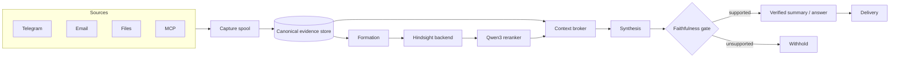

<div align="center">


# hermes-memory

**Evidence-backed personal memory for the Hermes agent, built on Hindsight.**


<br/>


</div>

---

Most agent memory stores what happened and repeats it back. **hermes-memory keeps what was actually observed, and then refuses to let the agent overstate it.** Every recollection traces to a canonical evidence record — who said it, when, in which words — and every sentence the system generates about a person is checked against that evidence *before* it is shown or sent.

It is local-first end to end: no cloud endpoint appears anywhere in the default configuration. Models run on loopback or a private LAN address you explicitly allowlist.

---

## The idea in one line

> Separate **what was observed** from **what is claimed** — and verify the second against the first, every time.

## Faithfulness, not vibes

Synthesis is evidence-first. The system generates candidate claims from canonical records, then runs each atomic claim through a separate entailment gate and classifies it:

- **supported** — rendered
- **contradicted** — rejected
- **insufficient evidence** — rejected

Only *supported* claims reach the reader. Malformed, truncated, or all-rejected results **withhold publication** — there is no unverified fallback and no automatic repair loop. On top of the semantic gate, deterministic vetoes catch the exaggerations a language model is most likely to let slip:

| Source record | Candidate claim | Verdict |
| --- | --- | --- |
| `Nisha is allergic to peanuts.` | Nisha is allergic to peanuts. | ✅ supported |
| `Nisha is allergic to peanuts.` | Nisha has a **severe** peanut allergy. | ❌ unsupported severity |
| `Nisha is allergic to peanuts.` | Nisha weighs **90 kg**. | ❌ new numeric detail |
| `मीरा: शायद शुक्रवार को जयपुर जाऊँगी।` | Meera **pakka** goes on Friday. | ❌ strengthened uncertainty |

The same discipline is exposed to the agent as a scoped `memory_verify` tool, so a paraphrased personal-memory assertion can be checked against canonical evidence instead of being trusted.

> **Honest scope.** This is a strong, tested safety layer — not a guarantee of zero hallucination. Free-form reflection remains untrusted derived prose, and model verdicts are not human annotations. See [`docs/memory-faithfulness-implementation.md`](docs/memory-faithfulness-implementation.md) for what was validated and what deliberately remains open.

## Architecture




1. **Capture** — connectors spool messages, mail, files and MCP threads into a durable queue.
2. **Canonical store** — the single source of truth: records with revision, provenance, offsets and visibility.
3. **Retrieval** — Hindsight supplies semantic recall; a local Qwen3 reranker re-ranks it; the context broker assembles a packet with lexical + semantic + derived channels and full provenance.
4. **Faithfulness gate** — evidence-first synthesis, per-claim entailment verification, deterministic vetoes, and digest re-checks before anything is published.
5. **Delivery** — owner-paired transport (e.g. Telegram) with an explicit pause and confirmed-delivery tracking.

## Features

- **Canonical evidence store** — every memory is a record you can point at; revisions and provenance are first-class.
- **Multilingual recall** — English, Hindi and Hinglish queries resolve to the same canonical facts.
- **Hybrid retrieval** — lexical + semantic channels plus a bounded, gate-accounted local reranker; graceful degradation when a model is offline.
- **Scoped verification** — `memory_verify` lets the agent check paraphrased assertions against canonical evidence.
- **Proactive, pausable delivery** — the agent can reach out, and the owner can hold every stage; nothing sends while paused.
- **Resource governance** — an admission gate with daily budgets, owner-granted allowances, and inference/delivery pauses; a budget that stops work *before* dispatch, not after.
- **Owner-controlled lifecycle** — forgetting, revocation and identity joins require the owner principal; erasure is confirmed, never inferred.
- **Release discipline** — reviewed staging and quiescent activation with migration rehearsal and automatic backups; the pointer only flips when the rehearsal passed.
- **Local-first** — loopback/LAN routes only, explicit allowlist, no cloud endpoint by default.

## Quick start

```bash
# install with the optional Hindsight bridge
pip install -e '.[hindsight]'

# create and migrate the canonical store
hermes-memory init

# copy and edit the owned env file, then verify the installation (read-only, no inference)
cp deployment/env/hermes-memory.env.example <home>/hermes-memory.env
hermes-memory doctor

# bring up the owned services: gate, backend, worker, reranker
hermes-memory start
```

Configuration lives in one owned env file (mode `0600`). Routes, credentials and the inference allowlist are explicit; see [`deployment/env/hermes-memory.env.example`](deployment/env/hermes-memory.env.example) for every knob and why it exists.

## Testing & evaluation

```bash
pytest            # offline contract + fixture suites
```

Live, synthetic end-to-end checks are opt-in and isolated (they never touch a personal archive and clean up their remote documents afterwards):

```bash
python evals/check_memory_faithfulness.py --live          # support/contradiction smoke gate
python evals/check_hindsight_reranked_flow.py --live \
    --output /tmp/flow.json                                # formation → recall → verify → publish
```

## Project layout

```
src/hermes_memory/     the framework: storage, processing, context, lifecycle, install
integrations/          the Hermes provider plugin (capture, delivery, memory_verify)
deployment/            systemd units, env examples, tested locks, compatibility manifest
evals/                 synthetic live checks and benchmarks (opt-in)
docs/                  research, implementation notes, audits and benchmarks
tests/                 contract, unit, integration, fault and review suites
```

## Documentation

- [`docs/memory-faithfulness-research.md`](docs/memory-faithfulness-research.md) — the recommendations this implements
- [`docs/memory-faithfulness-implementation.md`](docs/memory-faithfulness-implementation.md) — what was built, the failures reproduced, and the validation receipts
- [`docs/hindsight-qwen-reranker-integration.md`](docs/hindsight-qwen-reranker-integration.md) — the reranker route
- [`docs/operations.md`](docs/operations.md) — running, pausing, budgets and recovery

---

<div align="center">
<sub>Built for people who want their agent to <em>remember</em> — and to know the difference between remembering and inventing.</sub>
</div>
